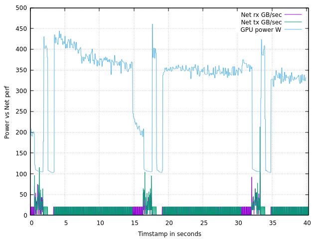

Collect ML perfromance GPU power + network traffic on a same graph in milisecond resolution
This is super usefull tool which gives you an overview of ML load pattern




### Example: collect data for network dev rdma0, gpu=0 for 40 seconds
```
./ml_sample_gen.sh 40 rdma0 0

```